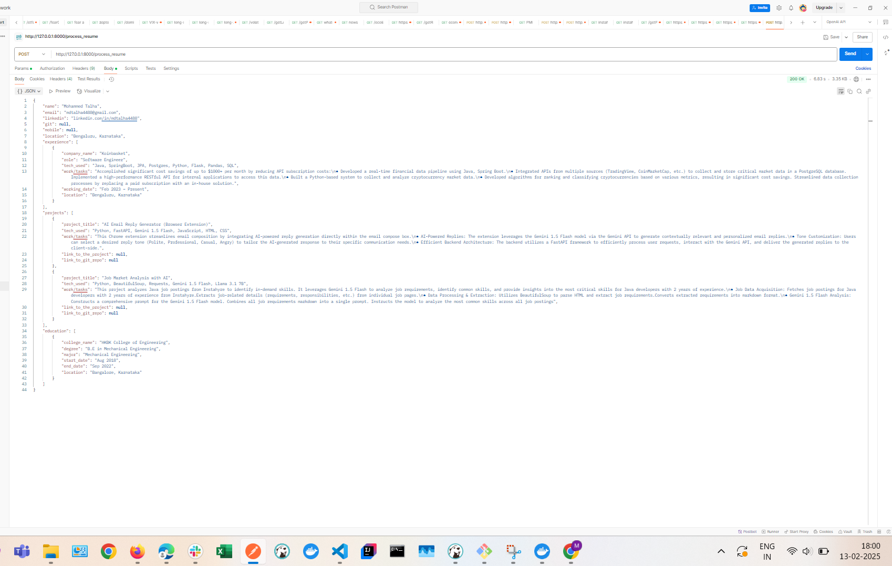

# AI-Powered Resume Parser 🧠📄

A FastAPI-based solution that converts unstructured resume PDFs into structured JSON data using Google's Gemini 2.0 Flash AI for intelligent text analysis.

## Features ✨

- **PDF Text Extraction** using PyMuPDF (Fitz)
- **AI-Powered Analysis** with Gemini Pro 2.0 Flash
- **Structured JSON Output** with consistent schema
- **REST API Endpoint** for easy integration
- **Asynchronous Processing** for better performance

## Tech Stack 🛠️

- **Framework**: FastAPI
- **AI Model**: Gemini Pro 2.0 Flash
- **PDF Processing**: PyMuPDF
- **Environment**: Python 3.10+

## Getting Started 🚀

### Prerequisites

- Check requirements.txt

Configuration
Get your Google API key from AI Studio

Create .env file:

env
GEMINI_API_KEY=your_api_key_here

Running the Service

bash
uvicorn main:app --reload
POST /process_resume
Accept: PDF file containing resume

Response: Structured JSON with parsed resume data

Example Request:
curl --location 'http://13.229.96.138:8000/process_resume' \
--form 'resume=@"/C:/Talha/09-02-2025-resume/Mohammed_Talha_SE.pdf"'

How It Works 🔍
PDF Upload: User submits resume PDF via API endpoint

Text Extraction: PyMuPDF extracts raw text from PDF

AI Analysis: Gemini 2.0 Flash processes text with structured prompt

Data Validation: Basic schema validation on AI output

JSON Response: Returns structured resume data

Example Output 📦
json

Architecture Overview 🏗️
User -> [FastAPI] -> PDF Text Extraction -> [Gemini 2.0] -> JSON Structuring -> Response
